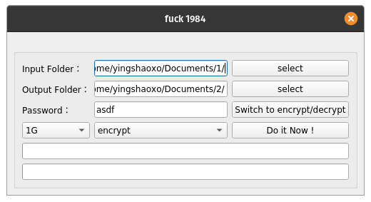

# fuck1984

[](https://github.com/yingshaoxo/fuck1984)
[](https://github.com/yingshaoxo/fuck1984)

Encode and Decode folders with password. 

## Features
1. go+qt，support mac、linux、windows
2. it keeps the folder tree unchanged while still encrypts the files inside of it
3. rc4 encryption
4. auto splits big file to parts of 1G/4G/10G/20G
5. single thread, no blocking
6. has a process bar
7. it saves the last folder info
8. input folder safe
9. the process can be resumed from the accidental power cut

## Usage
1. Open it
2. Choose input folder
3. Choose output folder
4. Give it a password
6. Hit 'Do it Now!' button

## Example


## Run
```
go run main.go alg.go
```
